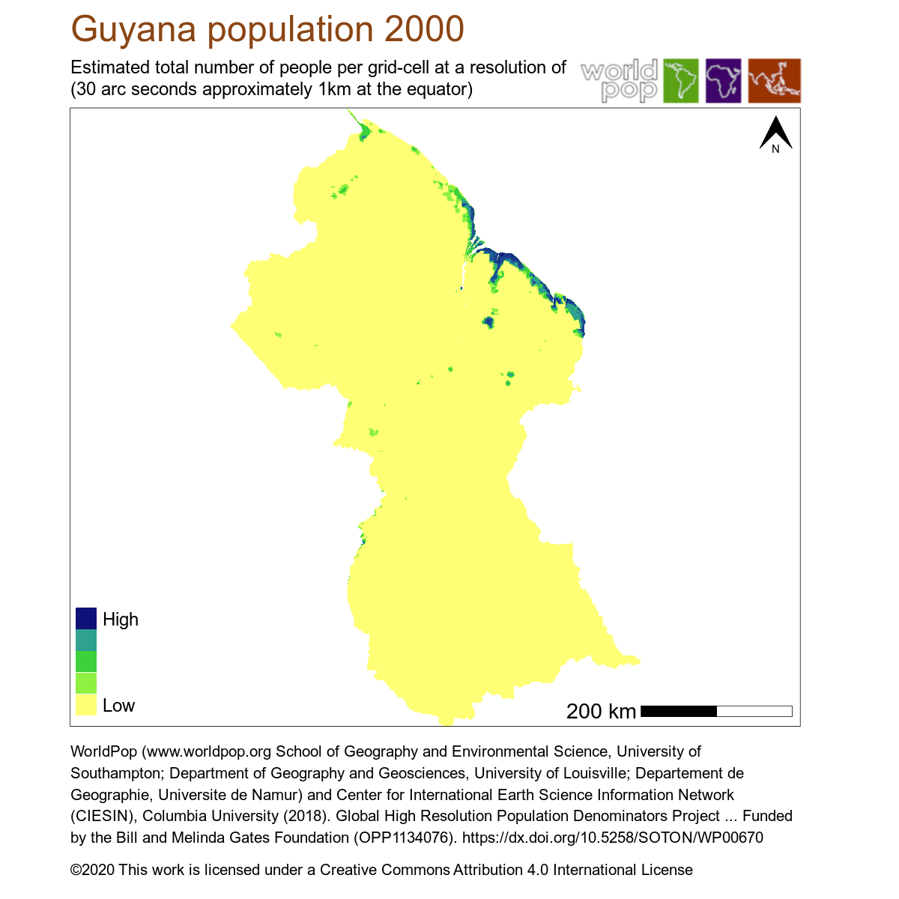

# Fetching Raster data from [WorldPop](https://www.worlpop.org)

## Python
We start with some basic imports
```python
import pandas as pd
from epigraphhub.data.worldpop import WorldPop
from IPython.display import display, Markdown, Image
```
Then we can instantiate an WorlPop object to consume the API:

```python
WP = WorldPop()
```
From the `WP` object we can browse the API and find out what data is available. For now, let's do an example: The Population of Guyana at 1km resolution.

```python
data = WP.get_data_by_country(alias='pop', level='wpic1km', ISO3_code='GUY')
Image(data['data'][0]['url_img'])
```


A full example of how to use the WorldPop module can be found [in this notebook](https://github.com/thegraphnetwork/epigraphhub_py/blob/main/examples/worldpop.ipynb)
